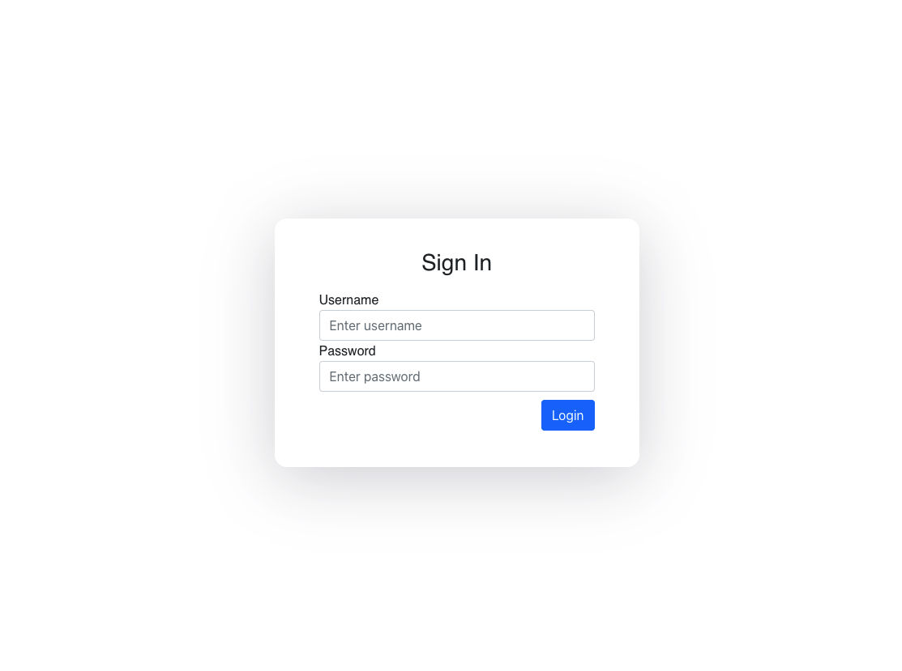
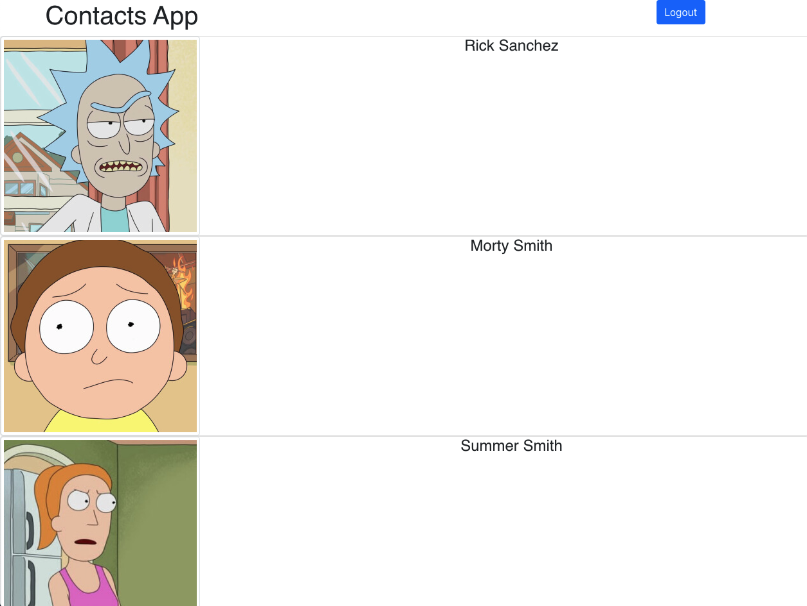
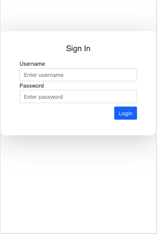
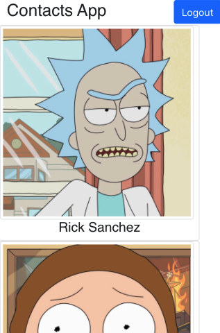

# Infinite Scroller App

## Instructions to run the application 
* clone the application
* On root level run `npm i`
* Once dependencies have been added, run `npm start`
* To run tests, run command `npm run test`

## Login Credentials

user: prabodh
password: admin@123

## Snapshots 

### Desktop View

#### Login Page

#### Home page

### Mobile view

    

        <h4> Login Page </h4>
        
    

    

        <h4> Home page </h4>
        
    

